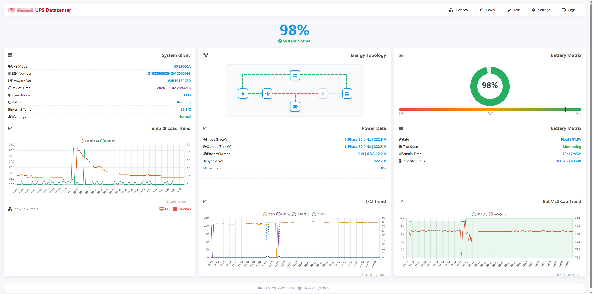
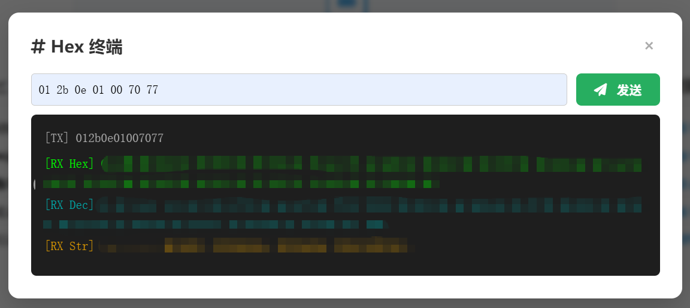
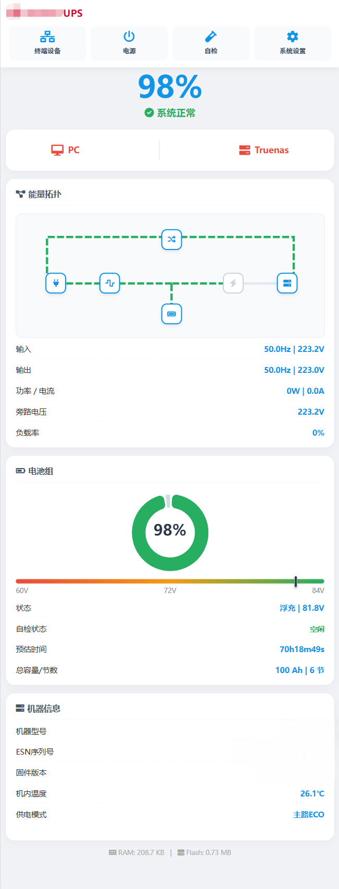
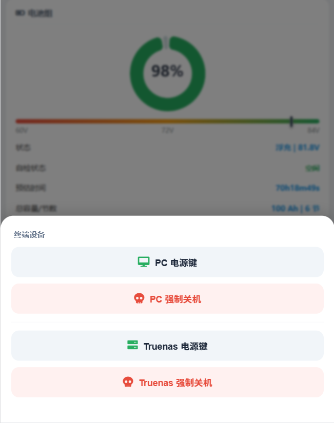
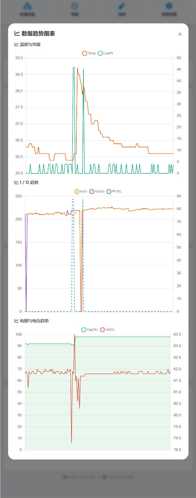
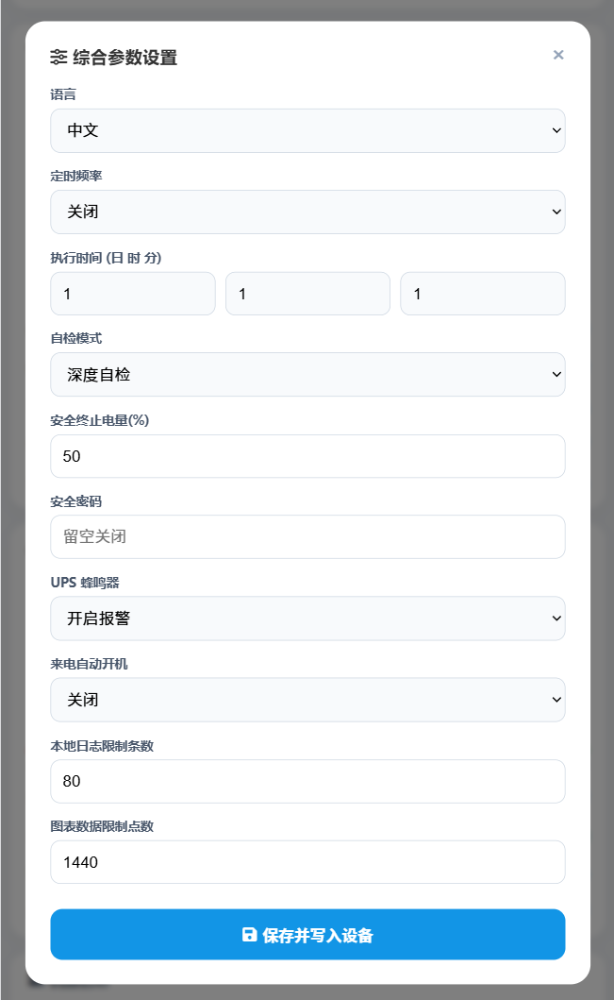
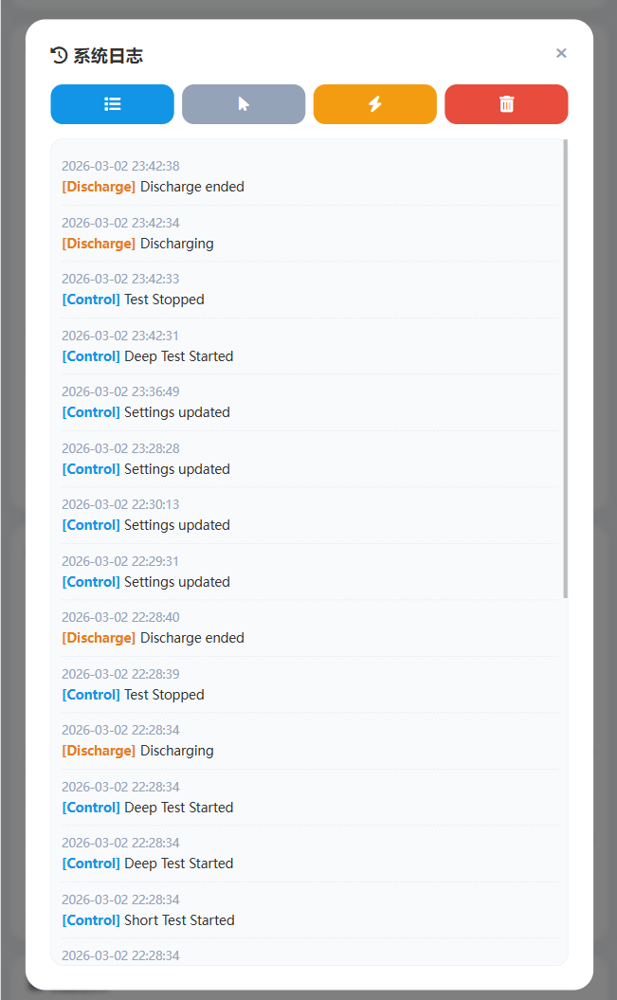
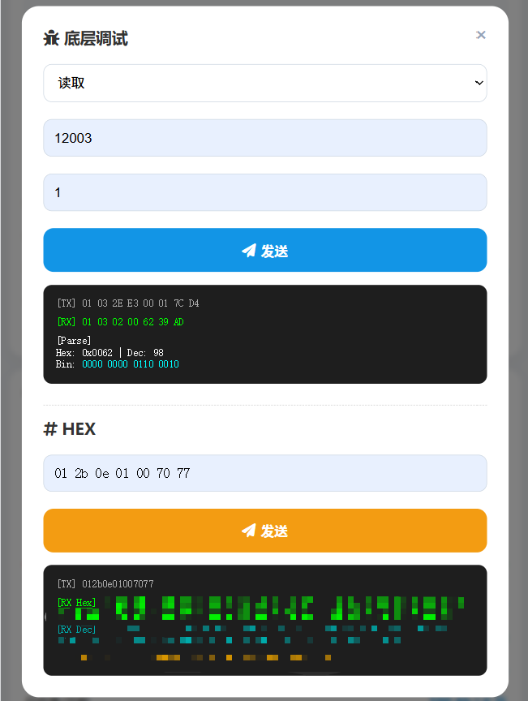

# ESP32 Smart UPS Monitor Gateway (MicroPython) / 智能 UPS 监控网关 (MicroPython 版)

[**English**](#english) | [**中文**](#chinese)

---

## 📖 Overview
This is a lightweight, fully functional Web monitoring gateway designed for Smart Commercial UPS systems (supporting standard Modbus-RTU). Built on the ESP32 using **MicroPython**, it integrates Modbus serial communication, a custom socket-based Web server, and a fully responsive HTML5 frontend.

It provides an incredibly accessible and easy-to-modify Python codebase for makers to monitor UPS status, battery health, and power metrics in real-time, view historic data charts, and hardware-control connected PCs via relays—all without relying on external cloud services.

### ✨ Key Features
* **🐍 Pythonic & Lightweight:** Written in pure MicroPython, making the core logic incredibly easy to read, debug, and customize.
* **📊 Real-time Dashboard & Charts:** Beautiful visualization of power flow, voltage, current, and battery capacity using `Chart.js`.
* **📱 Dual-End Responsive UI:** Dedicated user interfaces for both Desktop (`/`) and Mobile (`/m`) experiences.
* **📂 Native File Management:** Utilizes MicroPython's native OS module for JSONL-based configuration, logging, and history storage.
* **🔌 PC Power Control:** Integrated GPIO relay control to remotely hard-reset or power on your connected servers.
* **🛠️ Built-in Modbus Terminal:** Web-based terminal for direct HEX/Decimal Modbus RTU testing.

### 🧰 Hardware Requirements
1. **ESP32 Development Board**
2. **RS485 to TTL Module (e.g., MAX3485)** (Connected to ESP32 UART)
3. **DS1302 RTC Module** (For accurate offline timekeeping)
4. **Relay Modules** (Optional, for PC power control)
5. **Commercial UPS** (Supporting Modbus-RTU over RS485)

### 🚀 Installation & Usage
1. Flash the latest [MicroPython firmware](http://micropython.org/download/esp32/) to your ESP32.
2. Use an IDE like **Thonny** or tools like `ampy`/`mpremote` to access the ESP32 file system.
3. Upload `main.py`, `DS1302.py`, and the entire `res` folder (containing HTML/JS/CSS and `conf` files) to the root directory of the ESP32.
4. Edit `/res/conf/config.jsonl` to configure your local WiFi SSID and Password.
5. Reset the ESP32. Once connected to WiFi, the console will print its local IP address.
6. Visit `http://<ESP32_IP>` for the Desktop dashboard, or `http://<ESP32_IP>/m` for the Mobile app. Default security password is blank.

### 📸 Screenshots
**Desktop Interface**
| Dashboard (CN) | Dashboard (EN) |
| :---: | :---: |
|  |  |
| **Settings** | **System Logs** |
|  |  |
| **Modbus Debugger** | **HEX Terminal** |
|  |  |

**Mobile Interface**
| Main Dashboard | Bottom Status | Charts |
| :---: | :---: | :---: |
|  |  |  |
| **Settings** | **Logs** | **Debug Terminal** |
|  |  |  |

---

## 📖 项目简介
本项目是一个专为支持标准 Modbus-RTU 协议的某品牌商用智能 UPS 设计的轻量级 Web 监控网关。基于 ESP32 与 **MicroPython** 构建，它完美整合了底层串行通讯、基于 Socket 的定制 Web 服务器以及纯本地托管的现代 HTML5 响应式前端。

对于喜欢 Python 极简语法的创客来说，它提供了一套极易修改和二次开发的基础代码。你可以通过局域网实时监控 UPS 运行状态、查看历史曲线，甚至通过继电器远程硬控主机的开关机，完全脱离外部云端限制。

### ✨ 主要功能
* **🐍 纯粹的 Python 体验:** 核心代码采用 MicroPython 编写，逻辑清晰，免去了 C++ 复杂的编译过程，修改后即插即跑。
* **📊 实时数据看板与历史曲线:** 结合 `Chart.js`，优雅呈现电压、电流、负载率及电池容量趋势。
* **📱 响应式双端 UI:** 独立适配的桌面端 (`/`) 与极致流畅的移动端 (`/m`) 界面。
* **📂 原生文件系统驱动:** 借助 MicroPython 原生 `os` 和 `json` 模块，实现了高度可读的 JSONL 配置、历史与日志管理。
* **🔌 主机电源硬控:** 预留 GPIO 继电器接口，一键远程开机/强制重启服务器。
* **🛠️ 极客调试终端:** 内置网页版底层通讯调试端子，支持 HEX/十进制直发。

### 🧰 硬件需求
1. **ESP32 开发板**
2. **RS485 转 TTL 模块 (如 MAX3485)** (连接至 UART)
3. **DS1302 实时时钟模块** (确保断网时的时间戳准确)
4. **继电器模块** (可选，用于控制电脑开关机针脚)
5. **商用 UPS** (需支持 RS485 Modbus-RTU 通讯)

### 🚀 安装与使用说明
1. 为你的 ESP32 烧录最新的 [MicroPython 固件](http://micropython.org/download/esp32/)。
2. 使用 **Thonny** IDE 或 `ampy` 等工具连接 ESP32。
3. 将本项目中的 `main.py`、`DS1302.py` 以及完整的 `res` 文件夹（包含 HTML 等网页资源和 `conf` 配置目录）上传到 ESP32 的根目录。
4. 修改 `/res/conf/config.jsonl`，填入你家里的 WiFi 名称和密码。
5. 重启 ESP32。连上 WiFi 后，IDE 的终端会打印出 ESP32 的局域网 IP 地址。
6. 在浏览器输入 `http://<你的IP>` 访问电脑端，或 `http://<你的IP>/m` 访问手机端。初始安全密码为空。

### 📸 界面预览
*(请参考上方英文部分的展示图)*

---

## 🎉 Acknowledgments / 致谢
* **DeepSeek:** 感谢在前端 UI 设计、CSS 样式调优以及交互逻辑优化上提供的绝佳辅助，打造了极其美观的响应式数据看板。
* **Gemini:** 感谢参与 Python 后端核心架构的编写与调试，包括 Socket Web 服务器的搭建、DS1302 硬件时钟的驱动集成、Modbus 寄存器协议的精准解析，以及 JSONL 本地数据持久化方案的实现。

---

## ⚖️ Disclaimer / 免责声明
**[English]**
This is an unofficial, community-driven open-source project and is **NOT** affiliated with, endorsed by, or associated with any specific UPS manufacturer. 
* Any related trademarks are the property of their respective owners and are used in this project solely for descriptive purposes (Nominative Fair Use) to indicate protocol compatibility.
* This software is provided "AS IS", without warranty of any kind. Interacting with power equipment (UPS) carries inherent risks. The authors and contributors of this project assume no liability for any equipment damage, data loss, or safety incidents resulting from the use of this software.

**[中文]**
本项目为一个非官方的、由社区驱动的开源项目，与任何特定的 UPS 制造商**没有任何从属、赞助或合作关系**。
* 本项目中提及的任何相关型号或通讯协议均为其各自所有者的商标/资产。本项目仅在“描述性合理使用”的范畴内提及这些名称，以说明本软件的协议兼容性。

* 本项目代码及相关文件均基于“现状”提供，不作任何明示或暗示的保证。操作工业电源设备具有固有的危险性，由于使用本软件造成的任何设备损坏、数据丢失或安全事故，本项目作者及贡献者概不负责。
